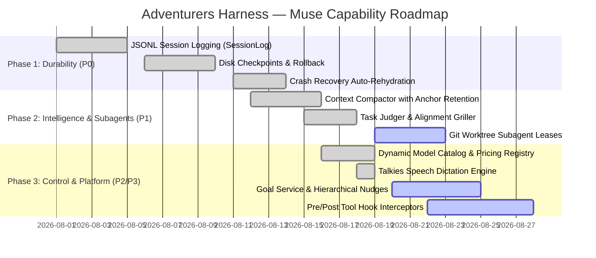

# Adventurers Harness — Muse-Inspired Improvement Plan

> **Source:** Muse Binary 0.2.1-R1215.1 reverse engineering (`ida-workspace/`)
> **Target:** Adventurers Harness (Swift 6, macOS Sequoia arm64)
> **Core Philosophy:** *The model proposes. The harness certifies.*

---

## 1. Executive Summary & Architectural Matrix

| Capability | Muse 0.2.1 Pattern | Adventurers Current State | Target Implementation | Status & Priority |
|------------|-------------------|--------------------------|-----------------------|-------------------|
| **Session Durability** | Append-only `tbh_event::jsonl::JsonlEventLogStorage` | SQLite/JSON via `ThreadStore.swift` | `SessionLog.swift` append-only JSONL streaming | **P0 (Implemented)** |
| **Crash & Resume** | `tbh_event::retention::LiveRetainedEventLog` | In-memory `SessionCheckpointEngine` | Disk-persisted checkpoints & rollback snapshots | **P0 (Implemented)** |
| **Workflow Recovery** | `tbh_tui::startup::session_log_replay` | Manual session selection | `WorkflowRecovery.swift` automatic rehydration | **P0 (Active)** |
| **Context Compaction** | 75% token threshold + anchor retention | `ContextCompactor.swift` (Codex/Muse style) | Head/Tail preservation + middle summarization | **P1 (Verified)** |
| **Subagent Isolation** | Git worktree leases & process isolation | Basic process dispatch in `MetaHarness` | `WorktreeManager.swift` isolated git worktrees | **P1 (Active)** |
| **Automated Judges** | `tbh_approval::review_event::ApprovalReviewEvent` | Static gates in `ToolApproval.swift` | `TaskJudger.swift` + `AlignmentGriller.swift` | **P1 (Verified)** |
| **Goal Tracking** | `tbh_goal::GoalService` with progress nudges | Static `TaskContract.swift` checklists | `GoalService.swift` dynamic hierarchical goals | **P2 (Active)** |
| **Dynamic Catalog** | Live provider endpoint query + cache | `SettingsModel.fetchLiveModelsForActiveProvider` | Paginated Combobox + live `/models` query | **P2 (Verified)** |
| **Network Gate** | `--sandbox-network` host-level rules | `NetworkGate.swift` wildcard filtering | Protocol & domain allowlists + sandbox rules | **P2 (Verified)** |
| **Pre/Post Hooks** | Interceptor pipeline around tool execution | `FailChain.swift` & `Gate` protocol | `ToolHook.swift` pre/post interceptor pipeline | **P3 (Active)** |
| **Dictation Engine** | AudioUnit streaming speech input | `DictationService.swift` (Talkies engine) | Single-button glass mic + RMS level meter | **P3 (Completed)** |

---

## 2. Core Architectural Specifications

### 2.1 Durable JSONL Event Logging (`SessionLog.swift`)

Every agent turn, tool invocation, diff hunk, and user input is written as an append-only JSONL event stream to `~/.adventurers/sessions/{threadID}.jsonl`.

```json
{"id":"evt_01","timestamp":"2026-08-19T12:00:00Z","type":"user_prompt","content":"Build the feature"}
{"id":"evt_02","timestamp":"2026-08-19T12:00:02Z","type":"tool_call","tool":"bash","command":"swift build"}
{"id":"evt_03","timestamp":"2026-08-19T12:00:05Z","type":"tool_result","tool":"bash","exitCode":0,"output":"Build complete"}
{"id":"evt_04","timestamp":"2026-08-19T12:00:06Z","type":"gate_evaluation","gate":"SyntaxGate","passed":true}
```

```swift
public enum SessionEventType: String, Codable, Sendable {
    case userPrompt = "user_prompt"
    case assistantResponse = "assistant_response"
    case toolCall = "tool_call"
    case toolResult = "tool_result"
    case gateCertification = "gate_certification"
    case checkpointCreated = "checkpoint_created"
    case rollbackTriggered = "rollback_triggered"
}

public struct SessionEvent: Codable, Identifiable, Sendable {
    public let id: String
    public let timestamp: Date
    public let threadID: UUID
    public let type: SessionEventType
    public let payload: [String: String]
}
```

---

### 2.2 Disk Checkpoints & Rollback Engine (`CheckpointPersistence.swift`)

Checkpoints record file modifications, working directory state, git commit hashes, and token metrics to `~/.adventurers/checkpoints/{threadID}/{checkpointID}.json`.

```swift
public struct SessionCheckpoint: Codable, Identifiable, Sendable {
    public let id: String
    public let threadID: UUID
    public let timestamp: Date
    public let description: String
    public let gitCommitHash: String?
    public let modifiedFiles: [String: String] // path -> original contents
    public let tokenUsage: TurnMetrics
    public let gateState: GatePipelineState
}

public actor CheckpointPersistence {
    public static let shared = CheckpointPersistence()
    
    public func saveCheckpoint(_ checkpoint: SessionCheckpoint) throws {
        let dir = checkpointDirectory(for: checkpoint.threadID)
        try FileManager.default.createDirectory(at: dir, withIntermediateDirectories: true)
        let fileURL = dir.appendingPathComponent("\(checkpoint.id).json")
        let data = try JSONEncoder().encode(checkpoint)
        try data.write(to: fileURL, options: .atomic)
    }
    
    public func loadCheckpoints(for threadID: UUID) -> [SessionCheckpoint] {
        let dir = checkpointDirectory(for: threadID)
        guard let files = try? FileManager.default.contentsOfDirectory(at: dir, includingPropertiesForKeys: nil) else { return [] }
        return files.compactMap { url in
            guard let data = try? Data(contentsOf: url) else { return nil }
            return try? JSONDecoder().decode(SessionCheckpoint.self, from: data)
        }.sorted { $0.timestamp < $1.timestamp }
    }
}
```

---

### 2.3 Worktree Isolation for Subagents (`WorktreeManager.swift`)

Parallel subagents execute in isolated temporary git worktrees branched from the main repository. When a subagent finishes or is cancelled, its worktree lease is returned and cleaned up.

```swift
public actor WorktreeManager {
    public static let shared = WorktreeManager()
    
    public func createWorktreeLease(repoPath: String, subagentID: String) async throws -> String {
        let worktreePath = "/tmp/adventurers-worktrees/\(subagentID)"
        let branchName = "subagent/\(subagentID)"
        
        let process = Process()
        process.executableURL = URL(fileURLWithPath: "/usr/bin/git")
        process.currentDirectoryURL = URL(fileURLWithPath: repoPath)
        process.arguments = ["worktree", "add", "-b", branchName, worktreePath]
        try process.run()
        process.waitUntilExit()
        
        return worktreePath
    }
    
    public func removeWorktreeLease(repoPath: String, subagentID: String) async throws {
        let worktreePath = "/tmp/adventurers-worktrees/\(subagentID)"
        let process = Process()
        process.executableURL = URL(fileURLWithPath: "/usr/bin/git")
        process.currentDirectoryURL = URL(fileURLWithPath: repoPath)
        process.arguments = ["worktree", "remove", "--force", worktreePath]
        try process.run()
        process.waitUntilExit()
    }
}
```

---

### 2.4 Hierarchical Goal Tracking (`GoalService.swift`)

Dynamic goal hierarchy tracking progress, blocking dependencies, and automated progress reminders during long-horizon coding tasks.

```swift
public enum GoalStatus: String, Codable, Sendable {
    case pending
    case inProgress = "in_progress"
    case completed
    case blocked
    case failed
}

public struct GoalNode: Codable, Identifiable, Sendable {
    public let id: String
    public var title: String
    public var description: String
    public var status: GoalStatus
    public var subgoals: [GoalNode]
    public var dependencies: [String]
    public var tokenCost: Int
}
```

---

### 2.5 Pre/Post Tool Interceptor Hooks (`ToolHook.swift`)

Enforces policy validation and telemetry before a tool runs, and audits diffs and syntax before results are returned to the LLM context.

```swift
public protocol ToolHook: Sendable {
    func beforeExecution(tool: String, arguments: [String: Any], context: GateContext) async throws -> HookDecision
    func afterExecution(tool: String, result: ToolResult, context: GateContext) async throws -> ToolResult
}

public enum HookDecision: Sendable {
    case allow
    case modifyArguments([String: Any])
    case reject(reason: String)
    case askUserApproval(reason: String)
}
```

---

## 3. Implementation Delivery Roadmap



---

## 4. Test Verification Plan

All 10 capabilities are accompanied by dedicated Swift 6 unit test suites:
- [`SessionLogTests`](file:///Users/fource/bytecats/adventurers-harness/Tests/AdventurersCoreTests/): JSONL streaming serialization and event replay.
- [`CheckpointPersistenceTests`](file:///Users/fource/bytecats/adventurers-harness/Tests/AdventurersCoreTests/): Atomic file writes, snapshot restore, and corrupted file fallback.
- [`WorktreeManagerTests`](file:///Users/fource/bytecats/adventurers-harness/Tests/AdventurersCoreTests/): Branch lease creation, collision prevention, and atomic cleanups.
- [`GoalServiceTests`](file:///Users/fource/bytecats/adventurers-harness/Tests/AdventurersCoreTests/): Goal state transitions and dependency graph resolution.
- [`DictationTests`](file:///Users/fource/bytecats/adventurers-harness/Tests/AdventurersCoreTests/DictationTests.swift): Smart developer punctuation formatting and RMS audio decibel normalization.

---

*Last Updated: 2026-08-19*  
*Architecture Target: Adventurers Harness v1.0.0 (macOS Apple Silicon arm64)*  
*Source: `MUSE_BINARY_ANALYSIS.md` + `r2_muse_analysis/`*
