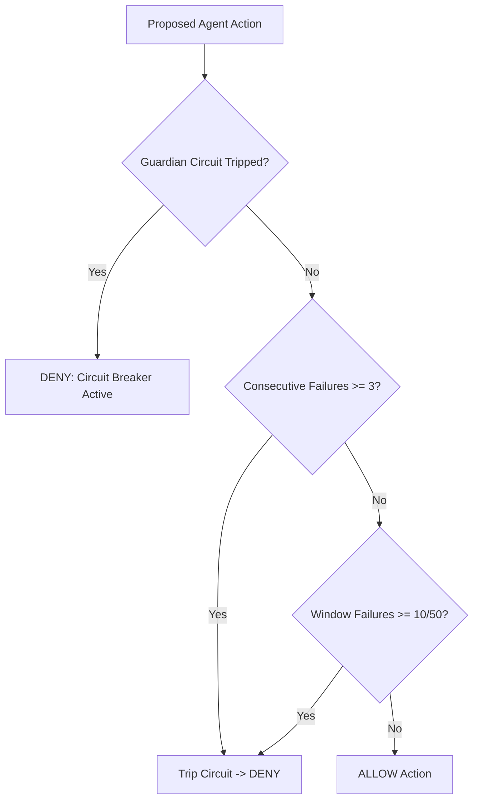

# Guardian Circuit Breaker & Fail-Closed Safety

> **Core Axiom**: *Safety is fail-closed. Any error, timeout, or ambiguity defaults strictly to DENY.*

---

## 1. Guardian Circuit Breaker (`GuardianCircuitBreaker.swift`)

The Guardian Circuit Breaker monitors turn outcomes and halts execution before runaway costs or cascading errors damage the workspace.

### Dual-Threshold Trigger System

1. **Consecutive Failure Threshold (3 turns)**: Three consecutive failed tool executions or compilation errors instantly trip the circuit breaker.
2. **Sliding Window Density (10 failures in 50 turns)**: Catches oscillating or intermittent failure loops.

---

## 2. Dangerous Command Detection (`DangerousCommandDetector.swift`)

Inspects bash commands, unrolls nested subshells (`sudo`, `bash -c`, `zsh -c`, `eval`, `osascript`), and detects destructive patterns before execution.

### 46 Banned Command Prefixes

The harness refuses automatic execution or suggestion of 46 dangerous shell operations, including:
- Destructive filesystem mutations: `rm -rf /`, `mkfs`, `dd if=`, `format`, `fdisk`
- Overly permissive permissions: `chmod -R 777`, `chown -R`
- Remote script execution: `curl | sh`, `wget | bash`, `curl | python`
- Destructive git operations on protected branches: `git push --force origin main`, `git reset --hard`
- Process termination: `killall -9`, `pkill -9`

---

## 3. Layered Execution Policy (`ExecPolicy.swift`)

Execution evaluation follows a strict cascade:
1. **Banned Patterns**: Evaluated first. Matches always yield `.deny`.
2. **Layered Rules**: Workspace `.adventurers/rules` $\rightarrow$ User Global $\rightarrow$ Built-in Defaults.
3. **`bypass_sandbox` Nuance**: Sandbox bypass is **ONLY** granted if **ALL** piped or chained command segments are explicitly allowlisted. If any segment is unclassified, sandbox isolation is strictly enforced.
