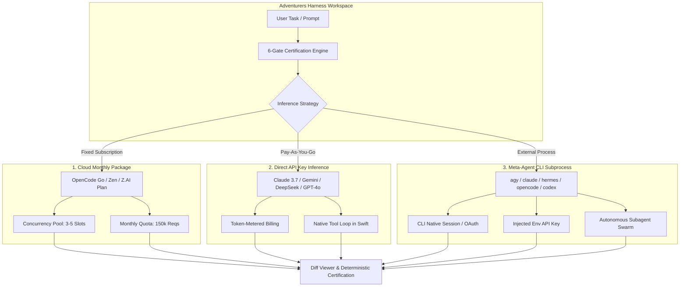

# Inference & Execution Paradigms in Adventurers Harness

Adventurers Harness unifies **three distinct execution and billing paradigms** into a single deterministic certification layer. Understanding the operational, economic, and architectural differences between them allows developers to pick the right engine for each task.

---

## The Three Inference Paradigms

---

## Paradigm 1: Cloud Monthly Package (Subscription Quotas)

**Examples**: OpenCode Go Cloud, OpenCode Zen Cloud, Z.AI Coding Plan.

### Characteristics:
- **Billing Model**: Flat predictable monthly fee (e.g. $10–$20/month) rather than per-token consumption.
- **Capacity Controls**:
  - Bound by **concurrency slots** (e.g. 3 to 5 parallel agent streams).
  - High monthly quota caps (e.g. 150,000 requests/month).
- **Architecture**:
  - Connects to dedicated gateway endpoints (`https://opencode.ai/zen/go/v1`, `https://api.z.ai/api/coding/paas/v4`).
  - Adventurers Harness manages the multi-turn reasoning and tool execution loop natively while streaming from the cloud gateway.
- **Best Suited For**:
  - Continuous pair programming, high-frequency coding sessions, long-running agent threads without token-burn anxiety.

---

## Paradigm 2: Direct API Key Inference (Pay-As-You-Go Metering)

**Examples**: Anthropic Claude 3.7 Sonnet / 3.5 Haiku, Google Gemini 2.5 Flash / Pro, DeepSeek V3 / R1, OpenAI GPT-4o, OpenRouter.

### Characteristics:
- **Billing Model**: Pure micro-metered token pricing (per-million prompt, completion, cache write, and cache read tokens).
- **Telemetry & Metering**:
  - Adventurers Harness tracks exact Time-To-First-Token (TTFT), tokens per second (TPS), and total session cost in real time via `MeteringTelemetry`.
- **Architecture**:
  - Direct HTTP/2 SSE streaming directly to frontier model APIs.
  - Native Swift 6 tool executor (`view_file`, `grep_search`, `write_file`, `bash`, `edit_file`).
- **Best Suited For**:
  - Deep architectural reasoning, cutting-edge frontier models (Claude 3.7 Thinking / Gemini 2.5 Pro), and tasks requiring exact token control.

---

## Paradigm 3: Meta-Agent CLI Subprocess Inference (Autonomous External Engines)

**Examples**: Google Antigravity (`agy`), Anthropic Claude Code (`claude`), Nous Hermes (`hermes`), OpenCode CLI (`opencode`), OpenAI Codex (`codex`), DeepSeek Harness (`dsh`).

### The Complexity: Dual Authentication & Subprocess Realities
External CLI agents are full-featured standalone systems that manage their own toolchains, internal state, subagents, and memory architectures. They differ fundamentally in how they are authenticated:

| Sub-Harness | Native Plan / Session | Injected API Key | Hybrid Support |
|---|---|---|---|
| **Google Antigravity (`agy`)** | Google Account / Artifacts Vault | `GEMINI_API_KEY` | ✔ Auto-detects local session, falls back to env key |
| **Claude Code (`claude`)** | Anthropic Web OAuth Subscription | `ANTHROPIC_API_KEY` | ✔ Uses cached OAuth token or injected key |
| **OpenCode CLI (`opencode`)** | `opencode auth login` (Go Cloud) | `OPENCODE_API_KEY` / OpenRouter | ✔ Supports both Go Cloud plan and direct API keys |
| **Nous Hermes (`hermes`)** | Local episodic SQLite memory | `HERMES_API_KEY` / `ANTHROPIC_API_KEY` | ✔ Subprocess isolation with custom args |
| **Codex CLI (`codex`)** | Rust engine native contract | `CODEX_API_KEY` | ✔ Environment key isolation |

### Authentication Modes in Adventurers Harness:
1. **`CLI Native Plan / OAuth Subscription`**: Subprocess inherits local credentials (`~/.claude.json`, `~/.config/opencode`, Google OAuth).
2. **`Injected Environment API Key`**: Adventurers Harness injects the user's encrypted keyring variable into the subprocess execution environment.
3. **`Hybrid (Native Session with Key Fallback)`**: Automatically checks if the CLI is logged in; if not, passes the configured API key seamlessly.

---

## Comparison Matrix

| Feature | 1. Cloud Monthly Plan | 2. Pay-As-You-Go API | 3. Meta-Agent CLI Subprocess |
|---|---|---|---|
| **Pricing Predictability** | 🟢 Fixed / Flat ($/mo) | 🟡 Variable per token | 🟢 Fixed or 🟡 Variable (depends on CLI auth) |
| **Tool Execution** | Native Swift 6 Sandbox | Native Swift 6 Sandbox | External Subprocess Subagent Engine |
| **Subagent Swarms** | Managed by Harness | Managed by Harness | Managed internally by CLI (`agy`, `claude`) |
| **Deterministic Gates** | 6-Gate Post-Flight Pass | 6-Gate Post-Flight Pass | 6-Gate Post-Flight Output Certification |
| **Offline / Local Gateway** | ❌ Requires Cloud Gateway | ✔ Ollama / Local API | ✔ Local CLI binaries (`hermes`, `dsh`) |
| **Context Window Control** | Harness Dynamic Compression | Exact Token Calculation | Managed by External Binary |

---

## Unified Deterministic Certification

Regardless of whether an answer is produced by:
1. A **Cloud Monthly Subscription** (OpenCode Go Cloud),
2. A **Direct Pay-As-You-Go API** (Claude 3.7 Sonnet), or
3. A **Sub-Agent CLI Binary** (`agy -p '...'` or `claude -p '...'`),

**Adventurers Harness subjects every diff and output to the same 6 deterministic gates**:
- **Gate 1**: `SyntaxGate` (AST and bracket balancing)
- **Gate 2**: `RepeatGate` (Anti-loop cycle detection)
- **Gate 3**: `DiffGate` (Protected file and safety verification)
- **Gate 4**: `CompilationGate` (`swift build` / compiler verification)
- **Gate 5**: `MemoryGate` (POSIX `rusage` resident memory bounding)
- **Gate 6**: `ObjectiveGate` (Acceptance keyword and task contract completion)
